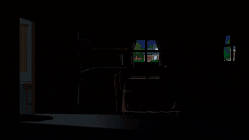

# Conclusion, ABadAvatar Stage 1 uses hardcoded RAM addresses, I don't currently own a copy of Tony Hawk's American Wasteland for further testing. Consider this project closed

Xbox360UpsetUpdate — 17526

An experimental work-in-progress port of [Grimdoomer's Xbox360BadUpdate](https://github.com/grimdoomer/Xbox360BadUpdate) from dashboard **17559** to **17526**. The current tree is based on BadUpdate v1.2 and [ABadAvatar](https://github.com/shutterbug2000/ABadAvatar)

This is an unofficial side project made for research and learning. It is not affiliated with or supported by the upstream developers.

> [!WARNING]
> This port is **not finished or confirmed working**. Some dashboard-specific values are still missing or unverified. Running the current files on real hardware is expected to freeze or fail. **AI-assisted tools have been used.**

## Current Progress (in priority order)

* [x] stop coping
* [x] Confirm Stage 1 is the current fail point
* [x] Wrap everything up and document findings
* [ ] final review of everything? 
* [x] Complete Avatar migration
* [x] Build proper Avatar Stage 1 implementation for 17526
* [x] Confirm Avatar has hardcoded addresses  
* [ ] Figure out Stage 3
* [ ] Final review for Stage 3 and Stage 4
* [x] Create a 17526 kernel configuration
* [x] Verify all kernel functions and gadgets
* [x] Verify all XAM functions and gadgets
* [x] Cross-check the syscall ordinals against the 17526 HV image
* [ ] Update the version-specific Stage 3 values
* [ ] Update the version-specific Stage 4 values
* [ ] Prepare the clean 17526 HV restore segment
* [ ] Build and inspect the completed binaries
* [x] Initial hardware test — current build fails as of 08/19
* [ ] Reach Stage 2
* [ ] Reach Stage 3
* [ ] Reach Stage 4
* [ ] Completion

# **Why are you doing this?**

This is a personal research project for getting BadUpdate working on my own specific Xbox 360 setup. I’m publishing the work because it may be useful as reference, but it is not intended to be a polished or universally compatible solution.

## Repository Contents

This repository contains my porting work, the inherited upstream source, configuration files, and reference files used during address comparison.

The `Binaries/` directory contains the 17526 and 17559 files used for comparison in Ghidra. These are research inputs, not finished release files. I plan to document how to reproduce the analysis setup later.

## Credits

* [Grimdoomer](https://github.com/grimdoomer) — original Xbox360BadUpdate project and research
* [Shutterbug2000](https://github.com/shutterbug2000) — ABadAvatar project
* [InvoxiPlayGames](https://github.com/InvoxiPlayGames) — Rock Band Blitz entry-point work
* Everyone who documented Xbox 360 internals and made this kind of research possible.
