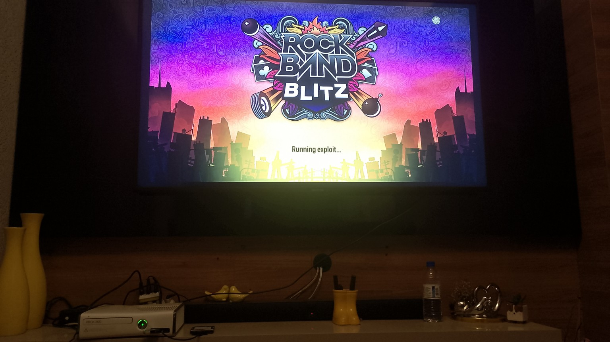

# Conclusion, Rock Band Blitz Stage 1 patch confirmed, currently EARLY Stage 2 fails, Stage 3 is substantially reached

# Xbox360UpsetUpdate — 17526

An experimental work-in-progress port of [Grimdoomer's Xbox360BadUpdate](https://github.com/grimdoomer/Xbox360BadUpdate) from dashboard **17559** to **17526**. The current tree is based on BadUpdate v1.2

This is an unofficial side project made for research and learning. It is not affiliated with or supported by the upstream developers.

> [!WARNING]
> This port is **not finished or confirmed working**. Running the current files on real hardware is expected to freeze or fail. **AI-assisted tools have been used.**

## Current Progress

* [x] Successfully Hex edited the pre-built Stage 1 Rock Band Blitz to patch 17526 in
* [x] Created a 17526 kernel configuration
* [x] Verified all kernel functions and gadgets
* [x] Verified all XAM functions and gadgets
* [x] Cross-checked the syscall ordinals against the 17526 HV image
* [x] An initial hardware test.
* [ ] Research Stage 3
* [ ] Final review for Stage 3 and Stage 4
* [ ] Update the version-specific Stage 3 values
* [ ] Update the version-specific Stage 4 values
* [ ] Prepare the clean 17526 HV restore segment
* [ ] Build and inspect the completed binaries
* [x] Reach Stage 2
* [x] Reach Stage 3
* [ ] Reach Stage 4
* [ ] Build a XeUnshackle 17526 Port
* [ ] Completion

# **Why are you doing this?**

This is a personal research project for getting BadUpdate working on my own specific Xbox 360 setup. I’m publishing the work because it may be useful as reference, but it is not intended to be a polished or universally compatible solution.

## Repository Contents

This repository contains my porting work, the inherited upstream source, configuration files, and reference files used during address comparison.

The `Binaries/` directory contains the 17526 and 17559 files used for comparison in Ghidra. These are research inputs.

## Credits

* [Grimdoomer](https://github.com/grimdoomer) — original Xbox360BadUpdate project and research
* [InvoxiPlayGames](https://github.com/InvoxiPlayGames) — Rock Band Blitz entry-point work
* Everyone who documented Xbox 360 internals and made this kind of research possible.
